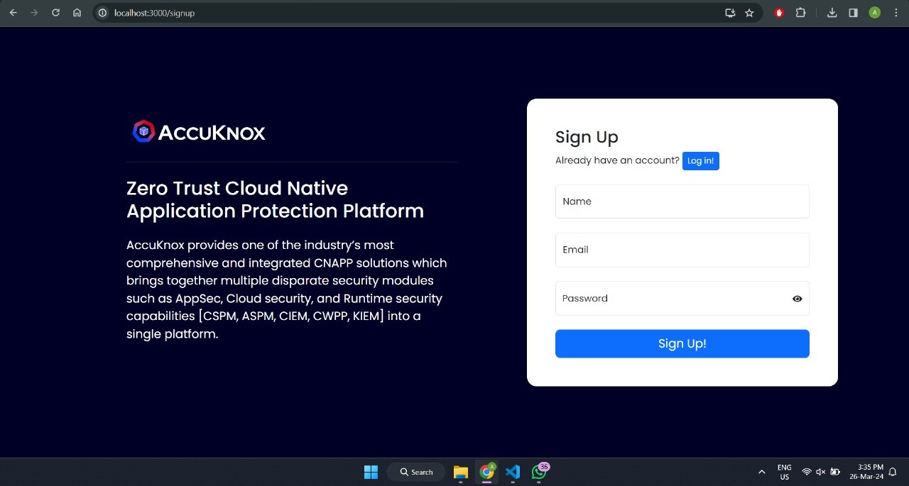
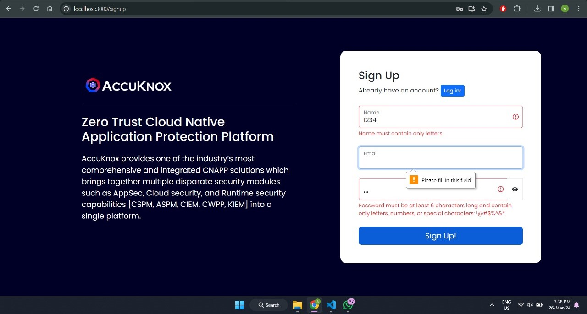
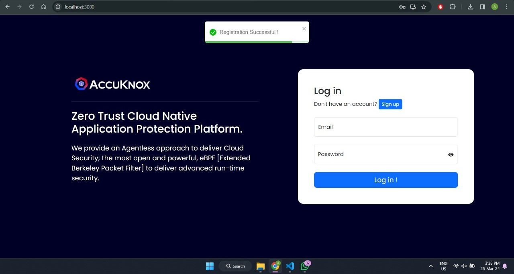
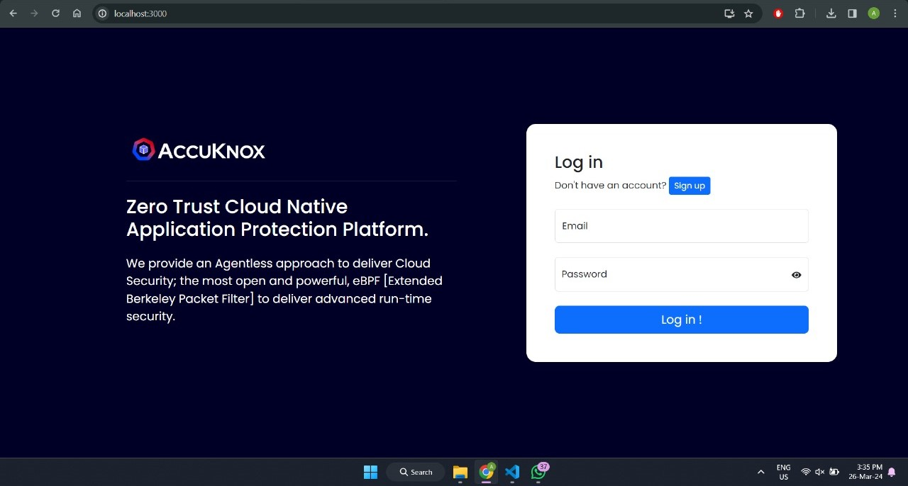

# User Authentication

This is a simple React application that demonstrates user authentication features including signup, login, and logout. It utilizes Redux for state management and local storage to persist user authentication details.

## Features

- **User Signup**: Users can sign up with a username and password.
- **User Login**: Registered users can log in with their credentials.
- **User Logout**: Users can log out from the application.
- **State Management**: User authentication state is managed using Redux.
- **Local Storage**: User authentication details are stored in local storage.

## Installation

Clone the repository using HTTPS:

```bash
git clone https://github.com/AmaanxAnsari/User-Authentication.git
```

Clone the repository using SSH Key:

```bash
git@github.com:AmaanxAnsari/User-Authentication.git
```

1.  Navigate to the project directory:

```bash
cd user-authentication
```

2. Install dependencies:

```bash
npm install
```

3. Start the development server:

```bash
npm start
```

## Dependencies

- React
- Redux
- React Redux
- Redux Thunk

## Usage

- Once the application is running, you can sign up with a new username and password and user credentials will be stored in localstorage.
- After successful authentication, you will be redirected to the authenticated section where you can see a welcome message and a logout button.
- Clicking on the logout button will log you out from the application and localstorage credentials will be removed.

## Screenshots







