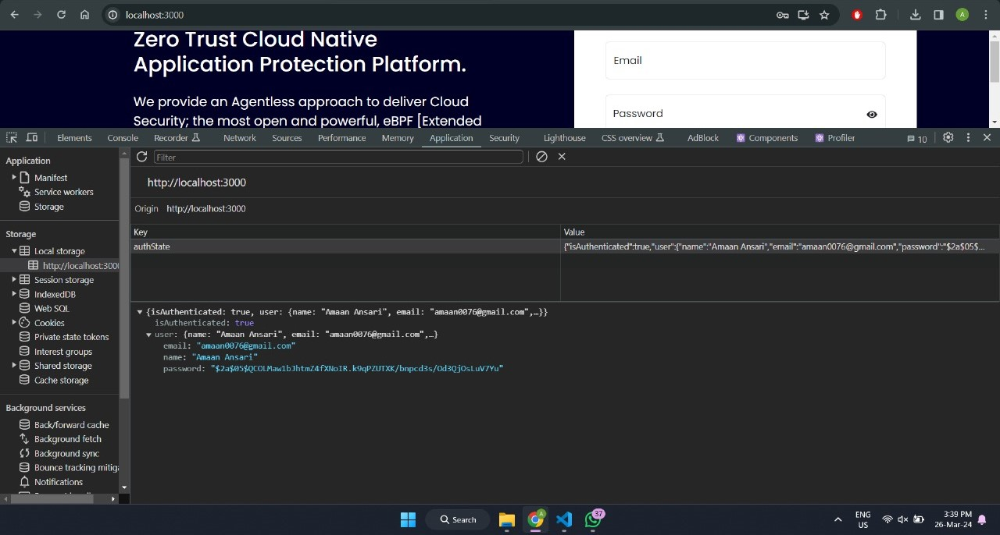
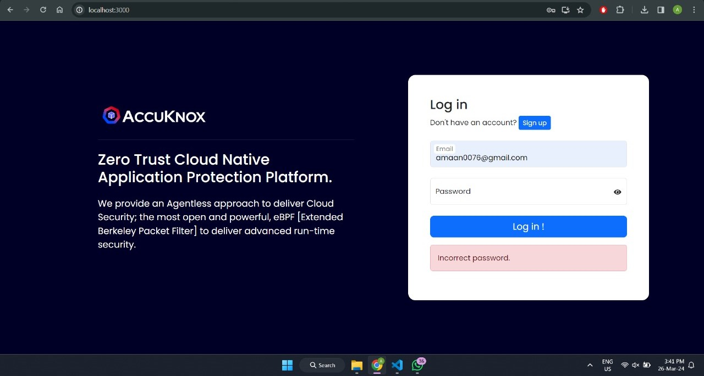
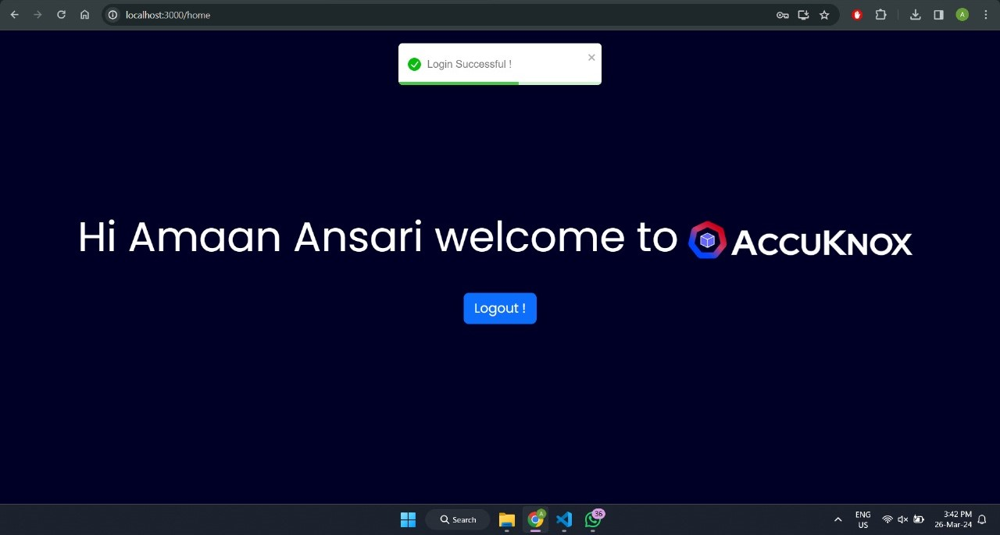
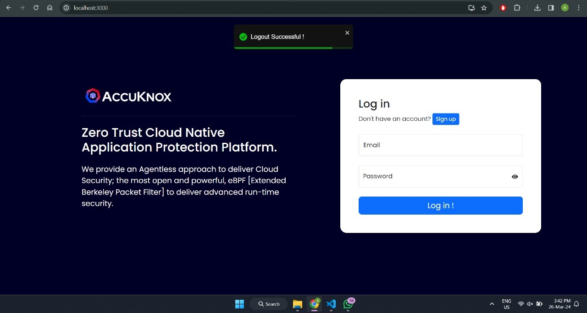
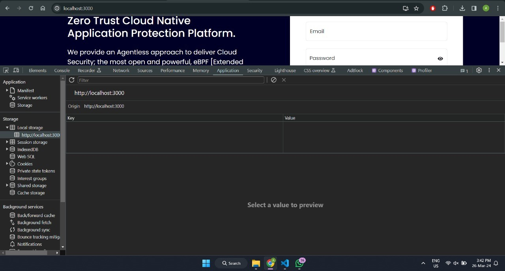

# User Authentication

This is a simple React application that demonstrates user authentication features including signup, login, and logout. It utilizes Redux for state management and local storage to persist user authentication details.

## Features

- **User Signup**: Users can sign up with a username and password.
- **User Login**: Registered users can log in with their credentials.
- **User Logout**: Users can log out from the application.
- **State Management**: User authentication state is managed using Redux.
- **Local Storage**: User authentication details are stored in local storage.

## Installation

Clone the repository using HTTPS:

```bash
git clone https://github.com/AmaanxAnsari/User-Authentication.git
```

Clone the repository using SSH Key:

```bash
git@github.com:AmaanxAnsari/User-Authentication.git
```

1.  Navigate to the project directory:

```bash
cd user-authentication
```

2. Install dependencies:

```bash
npm install
```

3. Start the development server:

```bash
npm start
```

## Note:

- While installing dependencies bcryptjs will give warning either ignore it or make certain changes in your node_modules.
- **node_modules\react-scripts\config\webpack.config.js**

```bash
resolve:{
fallback: {
      "crypto": false
    }
}

```

- add fallback object in resolve object mostly on line 305 or 306
- Restart your app and now the warning will be resolved.

## Dependencies

- React
- Redux
- React Redux
- Redux Thunk

## Usage

- Once the application is running, you can sign up with a new username and password and user credentials will be stored in localstorage.
- After successful authentication, you will be redirected to the authenticated section where you can see a welcome message and a logout button.
- Clicking on the logout button will log you out from the application and localstorage credentials will be removed.

## Screenshots


- Users can sign up with a unique username and password.


- Users can sign up with a unique username which contains only alphabets.
- Users can sign up with a unique email.
- Users can sign up with a unique password which is atleast 6 character long and consists upercase and lowercase alphabets along with numbers and symbols.


- Upon Successful Registration user is redirected to login page



- User credentials are stored in localstorage for further verification.
- Password is encrypted using bcryptjs Library.


- Registered users can log in with their credentials.


- Users must sign up before they can access the login page. Once signed up, they can log in with their credentials.


- Email validation is performed on the login page to ensure the entered email format is correct before proceeding with authentication.
- Additionally, the application checks whether the entered email is registered in the system before proceeding with authentication.



- Password validation is enforced to ensure it matches the password in localstorage.



- After successful authentication, users are redirected to the authenticated section where they can see a welcome message and a logout button.



- Upon clicking the logout button, users are successfully logged out from the application and redirected to the login page.



- Additionally, local storage is cleared to remove any stored user authentication details.

## Authors

- [@AmaanxAnsari](https://www.github.com/AmaanxAnsari)

## Support

For support, email amaan0076@gmail.com.
